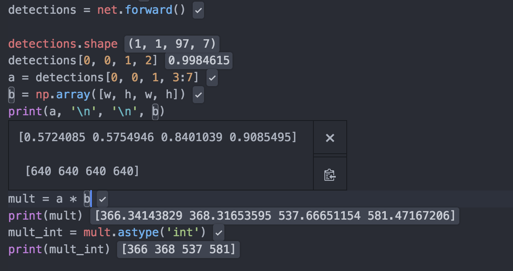

# Face Extractor
> Extract faces from images inside a folder.

CLI utility to extract faces from an image or a folder. Mostly based on the awesome
[article][dl_article] by [Adrian Rosebrock][pyimagesearch].

## Installation

OS X & Linux:

Clone the repository and run:

```sh
git clone https://github.com/rickaa/face_extract.git
chmod +x face_extract.py
```


## Usage example

**Place the images you want to extract faces from in the `input` folder**

```sh
./face_extract.py -f ./input/ -p deploy.prototxt.txt -m res10_300x300_ssd_iter_140000.caffemodel
```

**Detect faces in image `test1.jpg` but without extracting them**

```sh
./face_extract.py -i ./input/test1.jpg -p deploy.prototxt.txt -m res10_300x300_ssd_iter_140000.caffemodel
```

## Inner workings

The file `test_face.py`is meant to be run with a kernel so that you can see step by step what is going on
in a clearer way than just looking at the `for` loop in the main script.

For example:



## Release History

* 0.1.0
    * The first proper release


## Meta

[https://github.com/rickaa/](https://github.com/rickaa/)

## Contributing

1. Fork it (<https://github.com/rickaa/face_extract/fork>)
2. Create your feature branch (`git checkout -b feature/fooBar`)
3. Commit your changes (`git commit -am 'Add some fooBar'`)
4. Push to the branch (`git push origin feature/fooBar`)
5. Create a new Pull Request

[dl_article]: https://www.pyimagesearch.com/2018/02/26/face-detection-with-opencv-and-deep-learning/
[pyimagesearch]: https://www.pyimagesearch.com/
